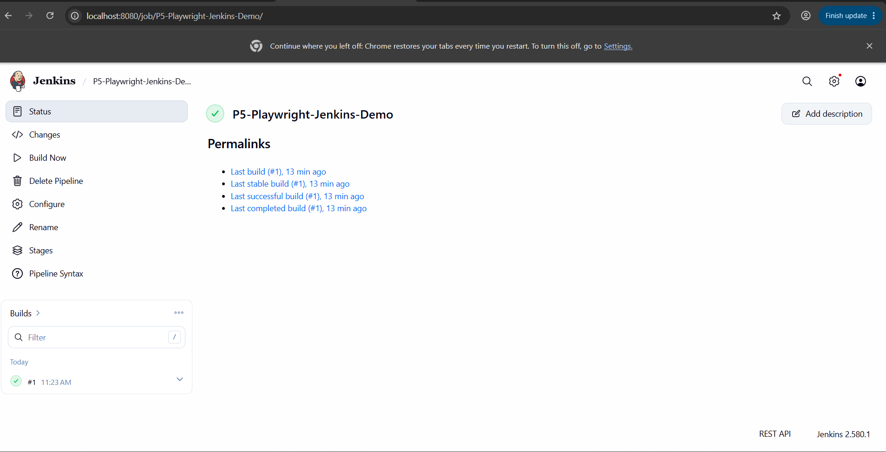
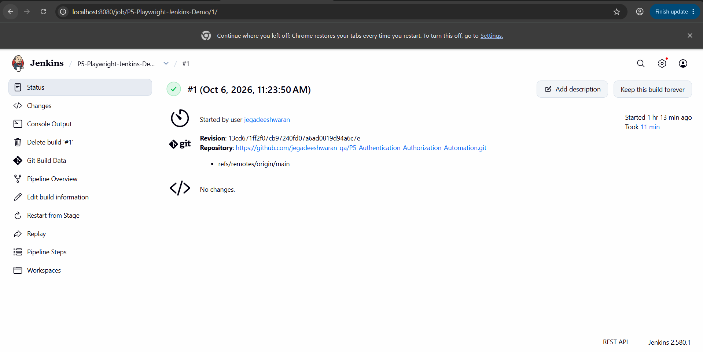

# P5 - Authentication and Authorization Automation

Playwright + TypeScript automation project for testing login, logout, and protected-page access.

## Project Overview

This project focuses on authentication and authorization testing for a practice web application.

## Application Under Test

**Expand Testing – Practice Login**

https://practice.expandtesting.com/login

## Tools and Technologies

- Playwright
- TypeScript
- Node.js
- Page Object Model
- GitHub Actions
- Jenkins

## Test Coverage

The project includes 33 Playwright tests across Chromium, Firefox, and WebKit.

Covered scenarios include:

- Valid login
- Invalid username
- Invalid password
- Empty credentials
- Logout
- Secure-page access after login
- Secure-page access without login
- Secure-page access after logout
- Authorization checks

## Automation Approach

The project uses the Page Object Model to keep page locators and reusable actions separate from test cases.

The tests include:

- Role-based locators
- CSS and test ID locators
- Assertions
- Positive and negative scenarios
- Authentication and authorization validation
- Cross-browser execution

## Project Structure

```text
P5-Authentication-Authorization-Automation/
├── .github/
│   └── workflows/
│       └── playwright.yml
├── pages/
│   ├── login.page.ts
│   └── secure.page.ts
├── screenshots/
│   ├── jenkins-built1.png
│   └── jenkins-built2.png
├── test-data/
│   └── users.ts
├── tests/
│   ├── authorization.spec.ts
│   └── login.spec.ts
├── Jenkinsfile
├── package.json
├── package-lock.json
├── playwright.config.ts
└── README.md
```

## Test Execution

Install dependencies:

```bash
npm install
```

Install Playwright browsers:

```bash
npx playwright install
```

Run all tests:

```bash
npx playwright test
```

Run tests on Chromium:

```bash
npx playwright test --project=chromium
```

## GitHub Actions CI

GitHub Actions is configured to:

1. Check out the repository
2. Install npm dependencies
3. Install Playwright browsers
4. Run the Playwright test suite

## Jenkins CI

This project was also executed through a Jenkins pipeline on Windows.

The Jenkins pipeline:

1. Clones the GitHub repository
2. Installs npm dependencies
3. Installs Playwright browsers
4. Runs the Playwright test suite

The Jenkins build completed successfully.

## Jenkins Build Result





## What I Practiced

- UI automation using Playwright and TypeScript
- Authentication and authorization testing
- Page Object Model
- Positive and negative testing
- Cross-browser testing
- GitHub Actions CI
- Jenkins CI


7:21 PM
